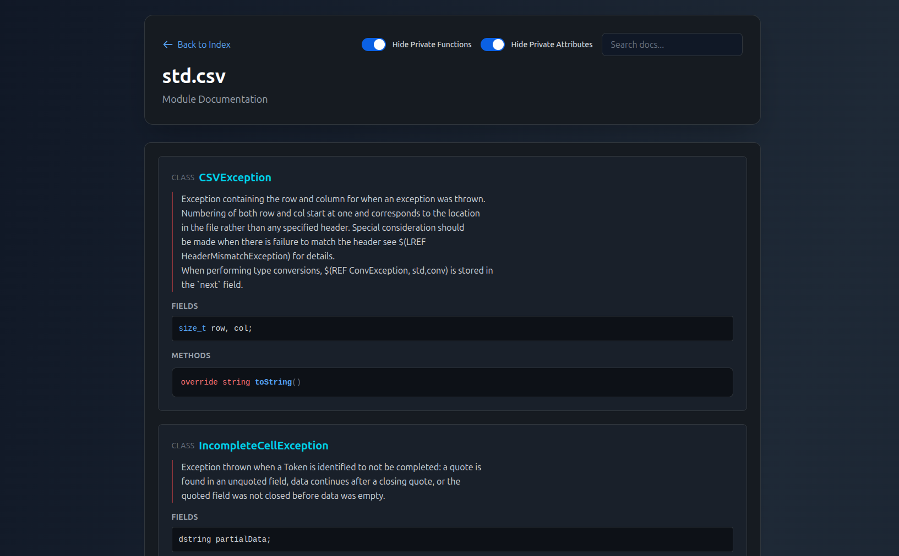

### Ceres

The purpose of this project is to create a documentation tool for Dlang code that requires no configuration.

DDOX, Doxygen, etc... all require vague configuration and intermittent build steps, Harbored has strange rendering caveats, and other options such as Javadoc are not Dlang-specific.

